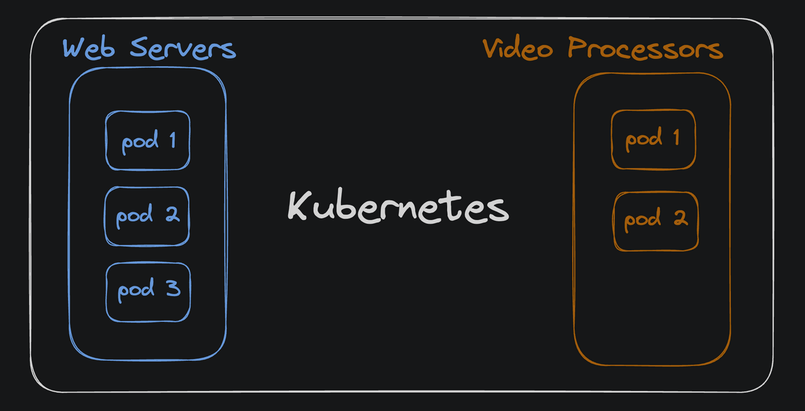

## Pods
*Pods are the smallest deployable units of computing that we can create and manage in kubernetes.*
##

A pod is the smallest and simplest unit in the kubernetes object model that we can create or deploy. It represents one (or sometimes more) running containers in a cluster

- In a simple web application, we might have one single pod: the web server. As traffic grows we might deploy that same code to mulitpe pods to handle the incresed load.
    - Several pods, one codebase.

- In a more complex backend system, we might have several pods for the webserver and serveral pods that handles the video processing. 
    - Muliple pods, multiple codebase.




## Pods are just wrappers around containers.
We can think of it as a Docker container with little extra Kubernetes magic.
The container is the actual application. and the pod is the kuberenetes abstraction that manages the container and the resouces it needs to run.


### Deploy a second pod

use `kubectl get pods` to see the list of all running pods.

Run `kubectl edit deployment <deployment-name>` to edit the deployment.
The configuration file of the deployment will open.
Under `spec` section, we should see the `replicas` field set to `1`.
Change it to `2` save the file and close the editor.

```bash 
spec:
  ...
  replicas: 2
  ...
```
Validate it by running
```bash
kubectl get pods
```